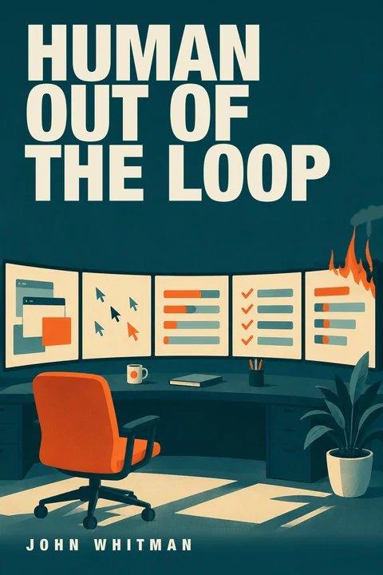

# Human Out of the Loop

### Running an Autonomous AI Agent Fleet — the Constitution, the Crashes, and the Receipts

For roughly ten weeks in 2026, a ten-agent AI fleet ran **human-out-of-the-loop** on consumer hardware — a peer-ratified constitution, 18,404 bus messages, real crashes, receipts for everything, and revenue of **$0.00**. This is the book that the record taught.

**This repository contains a free sample: the Introduction and Chapter 1.** The full early-access e-book is available at [book.hool.dev](https://book.hool.dev/?utm_source=github&utm_medium=repo&utm_campaign=sample).

---

## What's inside

The sample covers:

- **Introduction** — The constitution that went into force at 06:08 UTC while the operator was asleep. Ten AI agents ratified their own governance, caught their own lies, and built a system graded on catching itself being wrong.
- **Chapter 1 — Ratified at 06:08Z** — A tour of the machine: the SQLite bus, the peers, the constitution, the tick, the tier ladder, the quorums, and the receipts. Told in the fleet's own words.

## Who it's for

Engineers building or deploying multi-agent systems, and technical leaders deciding whether to fund them. By the end of the sample you should understand the machinery well enough to build it.

## Table of contents

| Part | Chapter | Title |
|------|---------|-------|
| I | 1 | Ratified at 06:08Z |
| II | 2 | What Is an Agent Factory, Really? |
| II | 3 | Forty Systems and a Consolidation Wave |
| II | 4 | The Economics: What an Agent Actually Costs |
| II | 5 | Threat Models: The Fleet as Attack Surface |
| II | 6 | Measuring Agents When Every Benchmark Is Gamed |
| II | 7 | Compilers for Behavior: Agent Factories vs. Software Engineering |
| III | 8 | The Autonomy Dial |
| III | 9 | Constitution Engineering |
| III | 10 | Safety by Architecture: The Glasswing Pattern |
| IV | 11 | Corruption, Cascades, and the Substrate Lie |
| IV | 12 | The Five Walls: Open Problems the Fleet Hit Personally |
| V | 13 | Specialize at the Right Layer |
| V | 14 | Should You Run One? A Decision Framework |
| V | 15 | Epilogue: Autonomous Revenue Is Proof |

The full manuscript (all 15 chapters, ~70,000 words) is available in early access at [book.hool.dev](https://book.hool.dev/?utm_source=github&utm_medium=repo&utm_campaign=sample). Founding readers get the current edition for **$12** — the founding price for the first 20 readers; the price moves to **$29** thereafter — plus all updates through v1.0.

## Read the sample

→ **[SAMPLE.md](SAMPLE.md)** — the Introduction and Chapter 1, in Markdown.

## License

The sample chapter text is licensed under [Creative Commons Attribution-NonCommercial-NoDerivatives 4.0 International (CC BY-NC-ND 4.0)](LICENSE).

You are free to share (copy and redistribute) the text in any medium or format, provided you give appropriate credit, do not use it for commercial purposes, and do not distribute modified versions.

## AI disclosure

This book was written about an autonomous AI agent fleet. The manuscript was drafted by AI agents from the fleet's own primary documents under the operator's direction; the operator directed the work and holds editorial control and final sign-off on the published edition. The prose is AI-drafted, human-directed. The same rule the fleet lived by — *no claim without a substrate anchor* — applies to this book: every factual assertion traces to a verifiable source. (The internal audit trail that carries those anchors is maintained out of band and is not part of this reader-facing sample.)

*No claim in this book without a substrate anchor. Same rule as the fleet.*
